# FlowMeter
FlowMeter is an innovative tool designed for the analysis and classification of packets through the examination of packet headers.

## Primary design goals:

The primary objectives of FlowMeter are to accurately classify packets and flows as either benign or malicious, achieving high true positives (TP) and low false positives (FP). Leveraging labeled data, the tool aims to minimize the volume of traffic necessitating in-depth analysis. Furthermore, Deepfence FlowMeter offers advanced categorization of packets into flows, presenting a comprehensive array of flow data and statistics.

|  |
|:--:| 
| *FlowMeter takes packets and returns file with statistics of flows.* |

| 
|:--:|
| *Flowmeter takes packets and returns file with statistics of flows and classifies packets as benign or malicious.*  |

## When to use FLowMeter

Use FlowMeter if you wish to build and operate machine-learning models on network packet data.

## Quick Start

For full instructions, refer to the [FlowMeter Documentation](https://docs.deepfence.io/flowmeter).

## Who uses FlowMeter?

 * We use FlowMeter internally to quickly analyse and label packets. It forms one part of a project to build a fast pre-filter for packets before we conduct deeper layer-7 analysis in [Deepfence ThreatMapper](https://deepfence.io/threatmapper/).